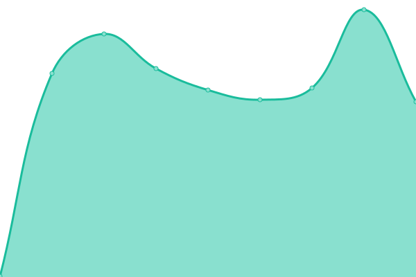
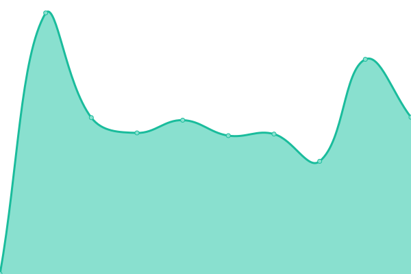
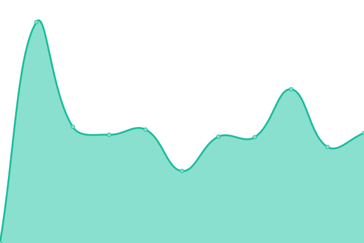

# [📈 Live Status](https://itishermann.me): <!--live status--> **🟧 Partial outage**

This repository contains the open-source uptime monitor and status page for [Upptime](https://upptime.js.org), powered by [Upptime](https://github.com/upptime/upptime).

With [Upptime](https://upptime.js.org), you can get your own unlimited and free uptime monitor and status page, powered entirely by a GitHub repository. We use [Issues](https://github.com/upptime/upptime/issues) as incident reports, [Actions](https://github.com/upptime/upptime/actions) as uptime monitors, and [Pages](https://itishermann.me) for the status page.

<!--start: status pages-->
<!-- This summary is generated by Upptime (https://github.com/upptime/upptime) -->
<!-- Do not edit this manually, your changes will be overwritten -->
<!-- prettier-ignore -->
| URL | Status | History | Response Time | Uptime |
| --- | ------ | ------- | ------------- | ------ |
|  [Portfolio](https://itishermann.me) | 🟩 Up | [portfolio.yml](https://github.com/itishermann/upptime/commits/HEAD/history/portfolio.yml) | 

 126ms
     
 | 

<a href="https://itishermann.me/history/portfolio">100.00%</a>
    

|  [Snowtrust](https://www.snowtrust.fr) | 🟩 Up | [snowtrust.yml](https://github.com/itishermann/upptime/commits/HEAD/history/snowtrust.yml) | 

 209ms
     
 | 

<a href="https://itishermann.me/history/snowtrust">100.00%</a>
    

|  [Hermann Codes](https://www.hermann.codes) | 🟥 Down | [hermann-codes.yml](https://github.com/itishermann/upptime/commits/HEAD/history/hermann-codes.yml) | 

 2648ms
     
 | 

<a href="https://itishermann.me/history/hermann-codes">6.74%</a>
    

|  [Shes.link](https://shes.link) | 🟩 Up | [shes-link.yml](https://github.com/itishermann/upptime/commits/HEAD/history/shes-link.yml) | 

 313ms
     
 | 

<a href="https://itishermann.me/history/shes-link">99.74%</a>
    

|  Smashpips/Back-end | 🟥 Down | [smashpips-back-end.yml](https://github.com/itishermann/upptime/commits/HEAD/history/smashpips-back-end.yml) | 

 0ms
     
 | 

<a href="https://itishermann.me/history/smashpips-back-end">6.75%</a>
    

|  Snowtrust/Boards | 🟥 Down | [snowtrust-boards.yml](https://github.com/itishermann/upptime/commits/HEAD/history/snowtrust-boards.yml) | 

 2389ms
     
 | 

<a href="https://itishermann.me/history/snowtrust-boards">6.75%</a>
    

|  Snowtrust/Finance | 🟥 Down | [snowtrust-finance.yml](https://github.com/itishermann/upptime/commits/HEAD/history/snowtrust-finance.yml) | 

 3315ms
     
 | 

<a href="https://itishermann.me/history/snowtrust-finance">6.75%</a>
    

|  Snowtrust/Wiki | 🟥 Down | [snowtrust-wiki.yml](https://github.com/itishermann/upptime/commits/HEAD/history/snowtrust-wiki.yml) | 

 3194ms
     
 | 

<a href="https://itishermann.me/history/snowtrust-wiki">6.75%</a>
    

<!--end: status pages-->

[**Visit our status website →**](https://itishermann.me)

## 📄 License

- Powered by: [Upptime](https://github.com/upptime/upptime)
- Code: [MIT](./LICENSE) © [Upptime](https://upptime.js.org)
- Data in the `./history` directory: [Open Database License](https://opendatacommons.org/licenses/odbl/1-0/)
